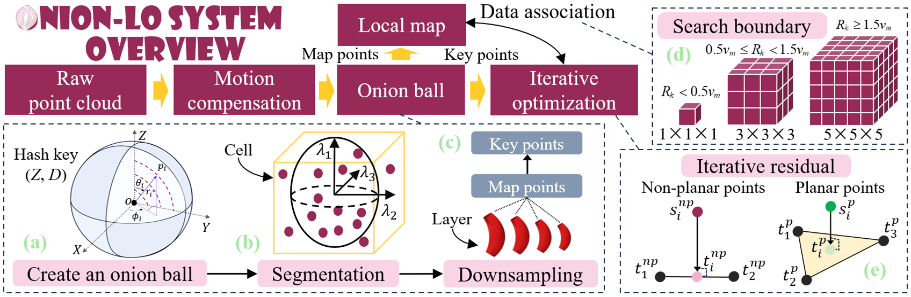
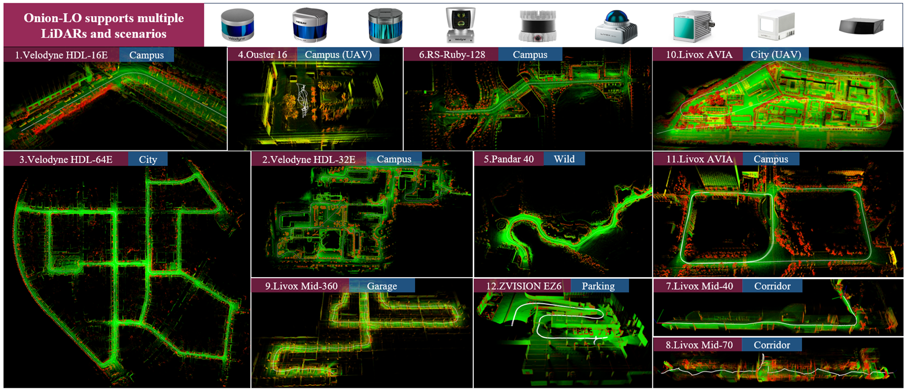

# **Onion-LO: Why Does LiDAR Odometry Fail Across Different LiDAR Types and Scenarios?**

## 📌 What is Onion-LO

Onion-LO is a general-purpose LiDAR odometry framework that supports a wide range of LiDAR types and complex scenarios, addressing the robustness limitations of traditional methods under varying hardware and environmental conditions. It is designed for seamless operation across diverse platforms, including high-altitude mapping, underground garages, handheld mapping, and autonomous driving applications.

### ✅ 1. System overview

<div align="center">
  
</div>

### ✅ 2. Seamlessly supports various LiDAR types and diverse scenarios

Supports the vast majority of LiDAR models available on the market, including Livox, Ouster, Hesai, Robosense, and Velodyne.
<div align="center">
  
</div>

### ✅ 3. Demo

| Dataset | Demo | Dataset | Demo |
|-----------|--------|-----------|--------|
| KITTI     |  | NCLT      |  |
| NTU       |  | HILTI     |  |
| SEU_A      |  | SEU_G      |  |
---

## ⚙️ Install

Recommended System **Ubuntu 20.04 + ROS Noetic**

### 🔧 Dependency

```bash
# 1. Livox SDK
cd livox_sdk/build
cmake ..
make -j8
sudo make install

# 2. fmt
cd fmt/build
cmake ..
make -j8
sudo make install

# 3. Eigen
cd eigen/build
cmake ..
make -j8
sudo make install

# 4. Sophus
sudo apt-get install ros-noetic-sophus

# 5. Ceres Solver
sudo apt-get install libceres-dev

# 6. PCL
sudo apt install libpcl-dev
sudo apt install pcl-tools

# 7. OpenCV
sudo apt install libopencv-dev python3-opencv

# 8. Others
sudo apt-get install ros-noetic-tf2-sensor-msgs
sudo apt-get install ros-noetic-eigen-conversions
sudo apt-get install liboctomap-dev
sudo apt install ros-noetic-octomap ros-noetic-octomap-rviz
```

### 🔧 Build
```bash
git clone 
cd onion-lo
catkin_make
source devel/setup.bash
```
### 🔧 Parameters
| Parameter  | Introduction |
|-------|------|
| seg_angle     | This parameter is used to estimate the occupied volume of the point cloud and is generally set to a value no less than twice the LiDAR resolution. To reduce the impact of isolated points and ensure compatibility with most LiDAR sensors, it is set to 3°. If set too small, it leads to an underestimated volume and excessive extraction of redundant key points; if set too large, it overestimates the volume, resulting in insufficient key point sampling. |
| layer_thickness     | This parameter affects the segmentation speed of the point cloud. If set too large, it underutilizes multi-threaded computation, leading to reduced processing efficiency of the Onion ball structure. Conversely, if set too small, it can negatively impact the segmentation of distant point clouds. Common values include 3m, 5m, 7m, and 10m. |
| seg_angle     | This parameter should be determined based on the specifications and resolution of the LiDAR model. |
| exp_key_num     | This parameter defines the expected number of points entering the iterative optimization process. A larger value leads to more stable optimization but slower runtime, while a smaller value improves computational efficiency at the potential cost of stability. |
| voxel_size     | This parameter affects the search range for data association during the optimization process. In open environments or high-speed scenarios, a larger voxel size is recommended to ensure robust associations. However, a larger voxel size also increases the search space, leading to slower optimization iterations. When the map voxel size is set to 2 meters, the search boundary is adaptively adjusted to 2 m, 6 m, and 10 m based on the scene scale, accommodating both narrow and large aerial scenarios. |
| ESTIMATION_THRESHOLD_     | A larger convergence threshold accelerates the optimization process but may result in unstable outcomes, while a smaller threshold improves accuracy at the cost of increased computation time. We recommend setting the convergence threshold between 10^-3 and 10^-5 to balance optimization accuracy and efficiency. |

### 🔧 Run
After modifying the config file for your environment, you can run Onion-LO. Here is an example to test it with a Livox LiDAR.
```bash
roslaunch onion-lv livox.launch
rosbag play your_data.bag
```


