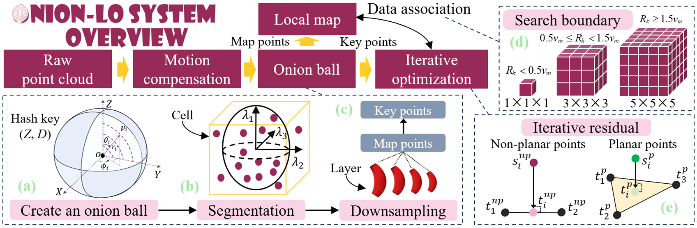
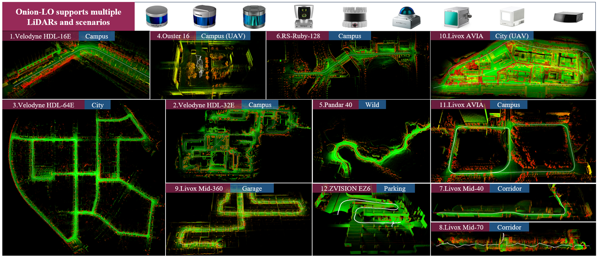

# **Onion-LO: Why Does LiDAR Odometry Fail Across Different LiDAR Types and Scenarios?**

## 📌 What is Onion-LO
**Our work has been accepted by RAL 2025! 🎉🎉🎉 The code is currently being organized and is expected to be released publicly in September 2025.**   
Onion-LO is a general-purpose LiDAR odometry framework that supports a wide range of LiDAR types and complex scenarios, addressing the robustness limitations of traditional methods under varying hardware and environmental conditions. It is designed for seamless operation across diverse platforms, including high-altitude mapping, underground garages, handheld mapping, and autonomous driving applications.

### ✅ 1. System overview

  

### ✅ 2. Seamlessly supports various LiDAR types and diverse scenarios

Supports the vast majority of LiDAR models available on the market, including Livox, Ouster, Hesai, Robosense, and Velodyne.

  

### ✅ 3. Demo

| Dataset | Demo | Dataset | Demo |
|-----------|--------|-----------|--------|
| KITTI     |  | NCLT      |  |
| NTU       |  | HILTI     |  |
| SEU_A      |  | SEU_G      |  |
---

